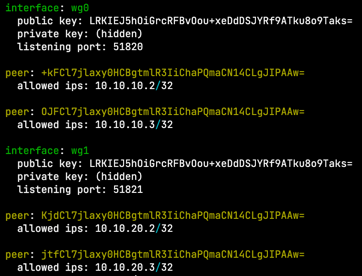
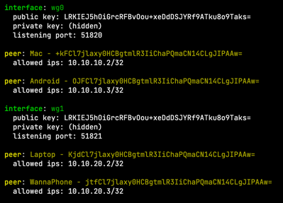
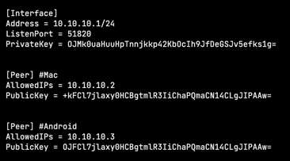

# Wireguard Name Resolver

**Wireguard Name Resolver** modifies the output of the **wg show** standard program and adds peer names to output. This allows you to quickly get information about connected clients.

## Example
### $ _wg show_




### $ _wg-resolver_



Peer names are loaded from the config files: **wg0.conf** and **wg1.conf**

### The config file **wg0.conf** looks like this




## Usage

### **wg-resolver** [interface or None]

```bash
$ wg-resolver
interface: wg0
  public key: LRKIEJ5hOiGrcRFBvOou+xeDdDSJYRf9ATku8o9Taks=
  private key: (hidden)
  listening port: 51820

peer: Mac - +kFCl7jlaxy0HCBgtmlR3IiChaPQmaCN14CLgJIPAAw=
  allowed ips: 10.10.10.2/32

peer: Android - OJFCl7jlaxy0HCBgtmlR3IiChaPQmaCN14CLgJIPAAw=
  allowed ips: 10.10.10.3/32

interface: wg1
  public key: LRKIEJ5hOiGrcRFBvOou+xeDdDSJYRf9ATku8o9Taks=
  private key: (hidden)
  listening port: 51821

peer: Laptop - KjdCl7jlaxy0HCBgtmlR3IiChaPQmaCN14CLgJIPAAw=
  allowed ips: 10.10.20.2/32

peer: WannaPhone - jtfCl7jlaxy0HCBgtmlR3IiChaPQmaCN14CLgJIPAAw=
  allowed ips: 10.10.20.3/32
```

```bash
$ wg-resolver wg0
interface: wg0
  public key: LRKIEJ5hOiGrcRFBvOou+xeDdDSJYRf9ATku8o9Taks=
  private key: (hidden)
  listening port: 51820

peer: Mac - +kFCl7jlaxy0HCBgtmlR3IiChaPQmaCN14CLgJIPAAw=
  allowed ips: 10.10.10.2/32

peer: Android - OJFCl7jlaxy0HCBgtmlR3IiChaPQmaCN14CLgJIPAAw=
  allowed ips: 10.10.10.3/32
```

## Installation

```bash
$ git clone https://github.com/wannawhat/wg-name-resolver
$ cd wg-name-resolver
$ chmod +x install.sh
$ ./install.sh
```
